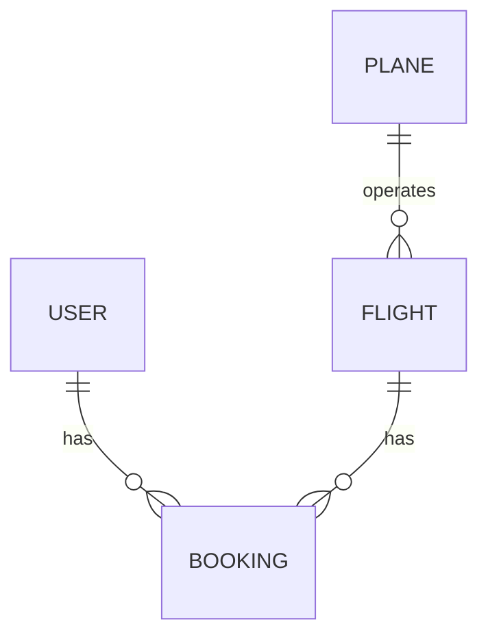

# Burning Airlines — junior developer portfolio audit

**Reviewed:** 14 September 2026  
**Scope:** React frontend, Rails backend, PostgreSQL schema, HTML/CSS, authentication, booking flow, tests and deployment configuration.  
**Approach:** Review the existing project on its own terms. Preserve its handwritten code, visual identity and architecture. No application changes were made for this audit.

## Overall assessment

**This is a credible junior developer portfolio project in progress, with its strongest evidence in visual design, CSS experimentation and building interactive frontend screens.** It also demonstrates practical exposure to Rails controllers, relational models, authentication libraries and a third-party flight API. The weakest areas are the contracts between those pieces: identifying a flight consistently, authenticating a user, saving their booking, enforcing seat availability, and recovering when a request or route is invalid.

I would describe it as **a substantial flight-search and booking-interface prototype whose durable booking flow is unfinished**. That is a useful project to discuss in an interview, particularly if you can explain the decisions and remaining work. I would not yet present it as a finished booking system or open it to real user accounts.

Your estimate of “80% done” can reasonably describe how many screens and visual elements exist. It does not establish that 80% of the engineering work is complete: saved bookings and shared seat availability involve authentication, database constraints, concurrent requests and recovery across browser sessions. These are central features, and you have correctly identified them as unfinished.

This assessment includes the current working trees, not only committed code. The recent contact mockup, scroll fix, provider error handling and six flight-search tests were assisted during this conversation; they should not be mistaken for independent evidence of your original authorship. The broader application and existing custom visual work provide the basis for the assessment.

| Area | Junior-level assessment | Main evidence / next step |
| --- | --- | --- |
| Visual design | Clear strength | Recognisable airline identity, custom curves, imagery, red controls and handwritten typography. Preserve this. |
| CSS implementation | Good practical experience; needs targeted discipline | Flex/grid, media queries, animations and responsive sizing are present; global selectors and layout overrides create fragility. |
| React | Useful foundations; integration still developing | Components, hooks, router state and API rendering are present; identity, persistent state and missing-data recovery need work. |
| Rails/API | Foundations demonstrated; substantial correctness gaps | Models, controllers, bcrypt and API integration exist; login wiring, response contracts and authorization need attention. |
| Database | Sensible entities; integrity incomplete | Users–bookings–flights–planes is a suitable starting model. Foreign keys, uniqueness and seat validation are missing. |
| Testing and deployment | Not yet ready for an unattended public demo with accounts | Frontend builds, but tests fail; startup can erase records and public account endpoints need protection. |

These are qualitative judgments about this project, not percentile rankings or a hiring prediction.

## What is worth preserving

- **A distinctive interface.** The wing imagery, curved carousel, branded navigation, seat map and airline-specific results show deliberate choices. A template replacement would erase useful portfolio evidence.
- **Practical CSS breadth.** The stylesheet uses gradients, transforms, animation, flexbox, grid, media queries and `clamp`/`min`/`max`. The issue is controlling their interactions, not a lack of CSS knowledge. See [App.css](/Users/Toms_Macbook/Projects/final-project-client/src/components/App.css:1).
- **Recognisable component boundaries.** Search input, results, seat selection, confirmation and authentication have separate components. They can be repaired without introducing a new framework or state library.
- **A real integration boundary.** The browser sends search criteria to Rails, which calls OAG and adds calculated prices. Keeping the provider credential on the server is the right direction. See [flight search](/Users/Toms_Macbook/Projects/final-project/app/controllers/flights_controller.rb:6).
- **A reasonable relational starting point.** A booking connects a user to a flight, and a flight belongs to a plane. `has_secure_password` is preferable to inventing password storage. See [User](/Users/Toms_Macbook/Projects/final-project/app/models/user.rb:1) and [schema](/Users/Toms_Macbook/Projects/final-project/db/schema.rb:17).

## Findings, in practical priority order

### 1. Deployment startup can delete existing data — critical before deployment

[entrypoint.sh](/Users/Toms_Macbook/Projects/final-project/entrypoint.sh:10) runs `db:seed` on every startup that uses this entrypoint. [db/seeds.rb](/Users/Toms_Macbook/Projects/final-project/db/seeds.rb:1) deletes users, planes, flights and bookings before recreating examples. Docker Compose explicitly selects this entrypoint. A restart through that path can erase the very stored flights you intend to add.

**Smallest appropriate fix:** separate migrations from optional demo seeding. Normal startup must preserve records. Do not hide migration errors and fall back to setup. Verify that a test booking survives a restart. This finding concerns the supplied entrypoint path; I did not deploy the application or run its destructive seeds during the audit.

### 2. User data and booking ownership are not protected — critical before real accounts

[UsersController](/Users/Toms_Macbook/Projects/final-project/app/controllers/users_controller.rb:15) returns whole user records from list/detail endpoints. The general authentication filter is commented out in [ApplicationController](/Users/Toms_Macbook/Projects/final-project/app/controllers/application_controller.rb:2). A read-only check of an unsaved user's serializer confirmed that `password_digest` is included. Login and signup also serialize whole user objects.

This exposes password hashes as well as account details if these endpoints are public. Hashing passwords is good, but hashes must still stay on the server. User IDs supplied by a browser also cannot establish ownership: [booking parameters](/Users/Toms_Macbook/Projects/final-project/app/controllers/bookings_controller.rb:31) permit `user_id` directly.

**Smallest appropriate fix:** explicitly select public response fields, authenticate account/booking routes, load bookings through the authenticated user, and derive `user_id` on the server. Verify that one user cannot read or book as another. No account data or credential values are reproduced in this report.

### 3. Login is wired to signup, and token handling disagrees — high

[LoginForm](/Users/Toms_Macbook/Projects/final-project-client/src/components/signIn/LoginForm.js:19) posts to `/users`, while the backend's authentication route is `/login`. Since email validation is commented out in [User](/Users/Toms_Macbook/Projects/final-project/app/models/user.rb:3), the sign-in form can create another account instead of authenticating the existing one.

Token handling has a second mismatch: [ApplicationController](/Users/Toms_Macbook/Projects/final-project/app/controllers/application_controller.rb:4) and [AuthController](/Users/Toms_Macbook/Projects/final-project/app/controllers/auth_controller.rb:39) use different signing/decoding secrets. Signup tokens do not contain the expiration used by login tokens. Missing authorization makes `session_user` call `.empty?` on `nil`; a direct Rails request returned **500** for `/auto_login` without a token. Logout removes the session user ID but leaves the stored token.

**Smallest appropriate fix:** one login endpoint, one token implementation, explicit invalid-credential responses, safe missing-token handling, consistent expiration, and one complete sign-out action. Use a small shared auth context if needed; Redux is not required.

### 4. Search, seat selection and confirmation use incompatible flight identities — high; part of the acknowledged unfinished flow

[ApiFlightTable](/Users/Toms_Macbook/Projects/final-project-client/src/components/booking/ApiFlightTable.js:45) constructs the route from a hash of `flightNumber`. [SeatMap](/Users/Toms_Macbook/Projects/final-project-client/src/components/flight/SeatMap.js:40) then uses `flightData.id`. [Confirmation](/Users/Toms_Macbook/Projects/final-project-client/src/components/confirmation/confirmation.js:13) submits using `flight.flightNumber` and reads `flight.departureDate`.

The earlier successful OAG response saved during this session contains `scheduleInstanceKey`, nested departure data, and **neither `id` nor `departureDate`**. This is a concrete data-shape mismatch. A flight number alone also does not distinguish airlines and departure dates. The Rails confirmation route exists, but a runtime action check confirmed that `FlightsController#confirmation` is not implemented.

**Smallest appropriate completion:** define one flight-instance representation at the backend boundary. Establish whether OAG's `scheduleInstanceKey` is suitable for your persistence needs before relying on it, map the selected instance to a local flight ID, and carry that same ID through seat selection and booking. Extract the date from the actual provider payload. Keep prices explicitly simulated: the current price is your calculation, not an airline fare offer.

### 5. A direct seat-page link crashes the app — high for a portfolio walkthrough

Seat and confirmation pages rely on `location.state` and dereference nested properties without a fallback. Opening `/book/flights/audit-direct-link` directly produced a blank page and `Cannot read properties of undefined (reading 'carrier')` in the browser. See [SeatMap](/Users/Toms_Macbook/Projects/final-project-client/src/components/flight/SeatMap.js:16) and [Confirmation](/Users/Toms_Macbook/Projects/final-project-client/src/components/confirmation/confirmation.js:8).

**Smallest appropriate fix:** while persistence is unfinished, show a useful return-to-search state when the flight is absent. Once persistent flight IDs exist, fetch the record from the URL. Router state may speed up navigation, but it cannot be the only way a route obtains required data. Do not assume every ordinary refresh loses router state; the confirmed failure is a fresh direct navigation without it.

### 6. Seat conflicts need database enforcement — high; acknowledged unfinished feature

The [booking controller](/Users/Toms_Macbook/Projects/final-project/app/controllers/bookings_controller.rb:6) checks whether *any booking for a flight* exists, not whether a particular seat is occupied. It reads a top-level `flight_id` for that check while creation accepts nested `booking` parameters. Even a corrected “check then create” can allow two simultaneous requests to pass.

The database has no booking indexes or foreign keys, confirmed through Active Record inspection. There is no unique constraint for a flight/row/column combination. The seat UI assumes 28 rows and six columns rather than reading a persisted aircraft layout.

**Appropriate completion:** validate the requested seat against your simulated plane layout, require the booking's user/flight/seat fields, and enforce a unique database index on `(flight_id, rows, cols)` for the current one-booking-per-seat model. Handle the losing concurrent insert as a conflict response. If you later keep cancelled booking rows, revisit that uniqueness rule deliberately.

A shared React context only coordinates components in one browser. It cannot prevent two visitors booking the same seat. PostgreSQL must decide which booking succeeds; the UI then refetches availability. Polling or push updates can improve freshness later. WebSockets, temporary holds and a new state-management library are not prerequisites for a correct portfolio version.

### 7. Saved flights need a consistent query and render flow — high; acknowledged unfinished feature

[MyFlights](/Users/Toms_Macbook/Projects/final-project-client/src/components/MyFlights.js:40) starts requests while mapping JSX and shares one `flight` state across all bookings. With multiple flights, requests can repeatedly replace one another's data and display the wrong details for a row. The header points to `mytrips`, whereas [the router](/Users/Toms_Macbook/Projects/final-project-client/src/index.js:77) registers `myflights`. The [profile](/Users/Toms_Macbook/Projects/final-project-client/src/components/profile/UserProfile.js:20) is still placeholder content.

**Smallest appropriate completion:** one authenticated endpoint returning the current user's bookings with their flight details; fetch it in an effect; render one complete record per row. Align the route names. The existing `User → bookings → flights` relationships already support this direction.

### 8. HTML semantics and accessibility need a focused pass — medium to high

The [results table](/Users/Toms_Macbook/Projects/final-project-client/src/components/booking/ApiFlightTable.js:64) nests rows inside rows, mixes `div` elements into table structure, and nests cells inside cells. Seat-map markup has similar issues. Some SVG properties use HTML spelling rather than JSX spelling. The browser tolerating these structures does not make them reliable table semantics.

Other concrete issues:

- Duplicate IDs were observed on the booking page, including `emailInput`, `form-control`, `input-group` and `flight-icons`.
- Booking inputs lack explicit associated labels. Signup labels are also mismatched in places.
- Hidden authentication content remains in the accessibility tree, with its buttons at `tabIndex: 0`; opacity and disabled pointer events do not remove keyboard focusability. See [AppWrapper](/Users/Toms_Macbook/Projects/final-project-client/src/index.js:50).
- [public/index.html](/Users/Toms_Macbook/Projects/final-project-client/public/index.html:6) restricts viewport zoom.
- Seat selection and the results disclosure button would benefit from `aria-pressed` and `aria-expanded`/accessible names respectively.
- Some navigation combines links and nested buttons; use one interactive element per action.

**Smallest appropriate fix:** retain the existing appearance while correcting the underlying markup. Use valid table rows/cells for actual tables, or ordinary containers for card layouts. Correct IDs/labels, allow zoom, and unmount or make the closed auth interface inert. Validate with keyboard-only navigation before changing any visual theme.

### 9. CSS is expressive, but global rules make local changes risky — medium

[App.css](/Users/Toms_Macbook/Projects/final-project-client/src/components/App.css:1) has 1,056 lines and 17 `!important` declarations. Size alone is not a failure. More consequential are global Bootstrap overrides such as `.w-100 { min-width: 800px; }`, duplicated snap rules, broad tag selectors, and combinations of fixed positions, viewport dimensions and clipping.

The desktop booking form shows deliberate branded composition. Contact layout was checked at 390px earlier in this session with no horizontal overflow. That does not establish mobile readiness for results and seats. Fixed navigation, wide result rows and the seat grid deserve separate small-screen checks.

There are several font imports with many families/weights, around **40 MB of source videos**, and roughly **6.1 MB of source images**. These are source-folder sizes, not measured initial network transfer. The compiled bundle is about **215 kB gzip JavaScript and 41.6 kB gzip CSS**, excluding separate media. I did not run Lighthouse or measure Core Web Vitals.

[VideoBackground](/Users/Toms_Macbook/Projects/final-project-client/src/components/booking/videoBackground.jsx:9) recreates its `videos` array on every render while using it as an effect dependency. That can repeatedly rerandomize the background after state updates. Animated media and carousel behavior also need a reduced-motion/pause strategy.

**Smallest appropriate fixes:** scope overrides to the component they belong to, remove only demonstrated duplicate/conflicting rules, stabilise video selection, and load only the media/fonts actually needed. Avoid rewriting the stylesheet or adding a design system solely to make it look more conventional.

### 10. Deployment configuration needs a rehearsal before publishing — high

Beyond the destructive startup path:

- API URLs are hard-coded to `http://localhost:3000` throughout the client. In a visitor's browser, localhost refers to their computer. Use one environment-configured API base URL and an HTTPS production endpoint.
- The backend Docker build uses `COPY . .`, and the repository has no `.dockerignore`. Git ignoring `.env` and `config/master.key` does not prevent Docker from copying them into an image.
- [flight_api_service.rb](/Users/Toms_Macbook/Projects/final-project/app/services/flight_api_service.rb:1) contains a credential literal and executes a network request at file scope instead of defining the expected service class. Production eager loading can trigger that request and/or a loader error. This is a source-reviewed risk; I did not run it against the legacy provider. Remove credentials from tracked code, review exposure history, and rotate exposed credentials without publishing their values.
- The main backend file is named `dockerfile`, while Fly references `Dockerfile`. Resolve that case mismatch for Linux builds. The configured prebuilt image versus source-build choice also needs to be made explicit.
- The frontend Dockerfile uses nginx without an included SPA fallback configuration. Its separate `static.json` is not nginx configuration. Direct `/book` and `/contact` requests need a fallback to `index.html`.
- The backend's production environment and secret injection are not established by the main Dockerfile/Compose configuration. Compose also lacks an explicit named PostgreSQL data volume; document durable storage instead of relying on incidental container storage.
- Ruby 2.7 reached end of life on 31 March 2023. Rails 7.0 is outside the current support window. These are maintenance concerns for a public backend, not reasons to discard your application. See [Ruby support status](https://www.ruby-lang.org/en/downloads/branches/) and [Rails maintenance policy](https://guides.rubyonrails.org/maintenance_policy.html).
- Create React App was deprecated in 2025. The current frontend still builds, so replacing its build tool is not the first priority here. See the [React announcement](https://react.dev/blog/2025/02/14/sunsetting-create-react-app).

Keep any runtime upgrades or deployment restructuring as a separately agreed task. This audit does not authorize a migration.

## Database design: keep the model, strengthen the rules

The intended relationships already make sense:

These arrows represent Active Record associations, not database-enforced foreign keys.

| Current area | Assessment | Targeted next step |
| --- | --- | --- |
| Users and bookings | Correct ownership relationship | Unique normalized email, required email, explicit ownership authorization |
| Flights and planes | Suitable starting relationship | Persist a dated flight instance and its appropriate simulated seat layout |
| Booking seat coordinates | Adequate for this prototype | Agree on row/column indexing and validate bounds; prevent duplicate allocation in PostgreSQL |
| Foreign IDs | Integer columns without database relationships | Add compatible foreign keys and indexes after checking existing data |
| Required values | Most business fields allow null | Add deliberate model validation and matching database requirements |
| Flight identity | Local date/from/to model does not yet represent the OAG instance | Store a stable provider reference plus enough dated flight details for saved trips |
| Plane fields | `planes.plane_id` has no evident role in the associations | Clarify its purpose before deciding whether it should remain |

There is no need to add passenger manifests, payment ledgers, fare classes or a complex inventory service just to finish this project. The database should enforce the promises this demo actually makes. OAG schedule data does not itself establish real airline seat availability; your seat inventory should be described as a simulation.

## Validation performed and its limits

| Check | Result |
| --- | --- |
| Production frontend build, output directed to `/tmp` | Passed with lint/dependency-age warnings |
| Frontend Jest command | Failed before running tests: `src/App.test.js` imports missing `./App` and still contains the default “learn react” test |
| Backend flight-search RSpec tests | 6 examples, 0 failures; provider calls mocked; status output directed to `/tmp` |
| User serialization on an unsaved object | `password_digest` included; no email validators configured |
| Booking metadata | No indexes or foreign keys on bookings |
| Rails confirmation action lookup | Action missing |
| Direct in-process Rails requests | `/auto_login` without credentials and legacy `/search/MEL/SYD` both returned 500 |
| Fresh direct seat URL in browser | Blank screen; undefined `flight.carrier` exception |
| Booking DOM inspection | Duplicate IDs and focusable hidden auth buttons found |
| Earlier live OAG test in this session | 10 results after updating the key; this was not a new live-provider test during the audit |

The legacy search error comes from setting `@all_flights` on the controller class and reading it on a request instance; see [FlightsController](/Users/Toms_Macbook/Projects/final-project/app/controllers/flights_controller.rb:73). It is distinct from the working OAG search action.

At the time of the audit's network check, the frontend was listening on 3001 but no backend was listening on 3000. Backend checks therefore used the Rails application directly in-process and the test suite. I did not stop or restart either server in this audit.

No bookings or user accounts were created, no deployment/seed command was run, and no production infrastructure was tested. This is a code and local-behavior review, not a complete penetration test, accessibility certification, dependency-vulnerability scan or load test. Existing uncommitted application work was preserved.

## A proportionate finishing plan

1. **Protect the demo first.** Remove destructive startup seeding, stop whole-user serialization, protect account routes and keep credentials out of Docker images/source. Acceptance: restart preserves data; unauthenticated visitors cannot retrieve accounts or create bookings for other users.
2. **Make authentication coherent.** Correct the login route, token implementation, validation and logout. Acceptance: signup, logout, valid login, invalid login and session restoration work predictably.
3. **Finish one durable booking journey.** Normalize one flight instance, select a valid seat, save it for the authenticated user, display it in My Flights, and retrieve it through a fresh direct URL. Acceptance: closing and reopening the browser does not lose a saved booking.
4. **Prove seat conflicts are handled.** Add database uniqueness and a conflict response. Acceptance: two sessions attempt the same seat; exactly one succeeds and the other receives clear feedback. This test matters more than an elaborate live-update interface.
5. **Repair the presentation edges.** Fix invalid table markup, missing-data fallbacks, labels, hidden focus targets and narrow-screen overflow. Preserve the visual design. Acceptance: complete the main flow using keyboard navigation and a phone-sized viewport.
6. **Rehearse the actual deployment.** One documented startup path, HTTPS API configuration, SPA deep links, durable PostgreSQL storage and supported runtime planning. Replace the frontend starter test with a few meaningful flow checks. Acceptance: a fresh checkout can be built and the deployed route can be opened directly.

A short README explaining setup, what is simulated, what works, and what remains unfinished will make the existing work much easier to assess. It should distinguish live schedules from calculated prices and simulated seat bookings, and acknowledge assistance accurately.

**My reviewer recommendation:** preserve the design and complete one reliable end-to-end flow before adding more features or polishing every unused variable. Being able to explain why the database prevents a duplicate seat booking—and demonstrate that it survives two competing requests—would strengthen the backend story more than adding another screen.
